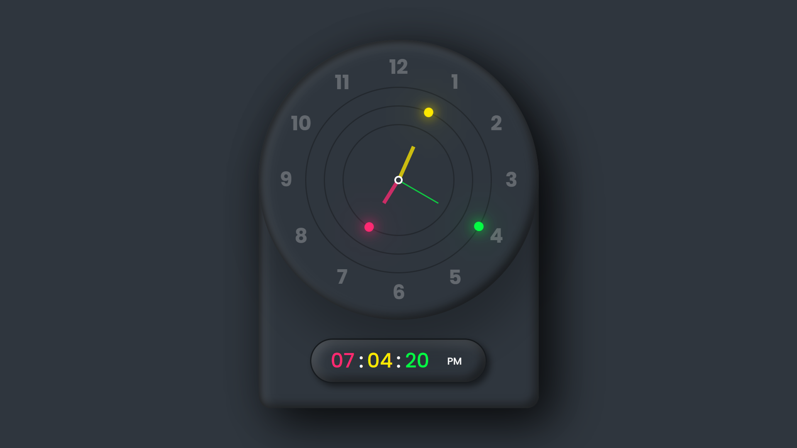

# Analog & Digital Clock

A stylish **analog and digital clock** built with HTML, CSS, and JavaScript.  
It features glowing clock hands, a neumorphic design, and a blinking digital display.

## Live Demo

[View it on GitHub Pages](https://pooya1484.github.io/analog-digital-clock)

## Features

-	Analog clock with hour, minute, and second hands
-	Digital clock with AM/PM indicator
-	Glowing, colorful clock hands
-	Neumorphic dark theme design
-	Mobile-friendly and responsive layout

## Screenshots



## Installation / Usage

1. Clone the repository:
	```bash
	git clone https://github.com/Pooya1484/analog-digital-clock.git
	```